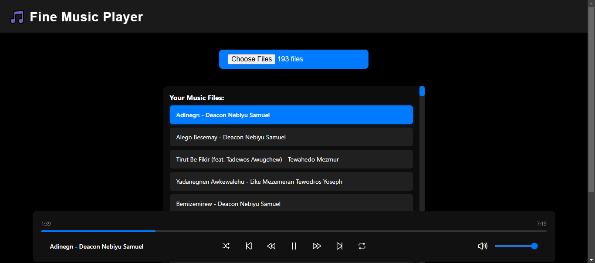

# Web Music Player 🎵

A modern and intuitive web-based music player that allows users to open and play audio files directly from their device. Built with HTML, CSS, and JavaScript, this player supports a wide range of audio formats and provides a seamless listening experience.

## Features ✨

- **Open Local Audio Files**: Browse and load audio files (MP3, WAV, OGG, FLAC, M4A) directly from your device.
- **Playback Controls**: Play, pause, skip, rewind, and fast-forward with intuitive controls.
- **Shuffle and Repeat**: Shuffle your playlist or repeat tracks for continuous listening.
- **Volume Control**: Adjust the volume with a slider.
- **Progress Bar**: Visualize and control playback progress.
- **Metadata Display**: Show track title, artist, album, and duration (if available).
- **Responsive Design**: Works seamlessly on both desktop and mobile devices.

## Live Demo 🌐

Check out the live demo of the Web Music Player: [Live Demo](https://fine.sweaven.dev/music.html)

## Usage 🎧
   Load Audio Files:
   
     Click the "Select Folder" button (or file input) to choose audio files from your device.
   
      Supported formats: MP3, WAV, OGG, FLAC, M4A.
   
  Play Music:

       Click on any track in the list to start playback.

       Use the playback controls to play, pause, skip, rewind, or fast-forward.

  Adjust Settings:

       Use the volume slider to adjust the volume.

       Enable shuffle or repeat modes for a customized listening experience.

# Technologies Used 💻
  
    HTML5: Structure of the web player.

    CSS3: Styling and responsive design.

    JavaScript: Core functionality and interactivity.

    jsmediatags: Extracting metadata from audio files.
